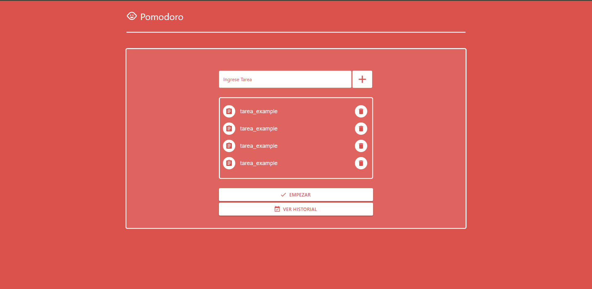
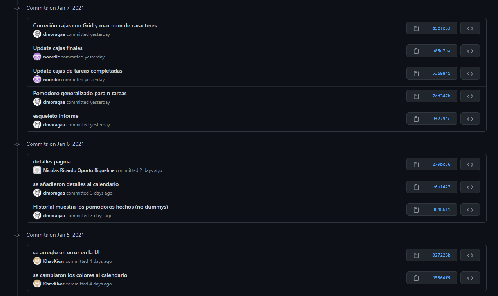
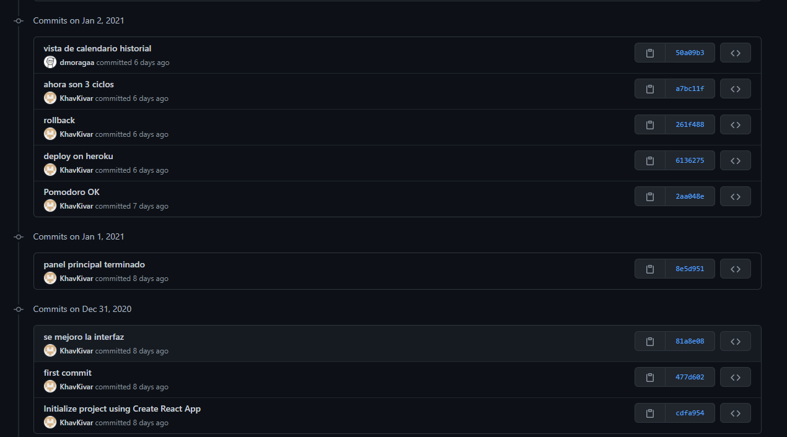

# Proyecto INF-322 Interfaces de Usuario

**Integrantes**:
* Sebastián Calderón 
* Diego Moraga 
* Nicolás Oporto 

### Descripción:
Pomodoro - productividad: la técnica pomodoro logra optimizar el tiempo y la eficiencia basándose en la idea del bloqueo de un cierto período de tiempo (en minutos) de concentración contínua. Consiste en usar un temporizador para dividir una sesión de trabajo o concentración en bloques de 25 minutos, cada uno de estos bloques se denomina como un pomodoro y representa el tiempo dedicado a realizar una tarea. Estos bloques de 25 minutos se separan por bloques más cortos de 5 minutos dedicados a descansar. Luego de completar una secuencia de 4 pomodoros seguidos con sus respectivos descansos intermedios, se toma un descanso mas extenso de 25 minutos. El método Pomodoro se basa en la idea de que las pausas regulares pueden ayudar a mejorar la agilidad mental y motiva al usuario a dar una respuesta eficiente en cuanto a la gestión del tiempo, en vez de el estado de ansiedad que suele provocar el pasar del tiempo sin metas o tareas definidas. Además, al evitar la multitarea, ayuda a alcanzar niveles de concentración más altos que son posibles gracias a las pausas regulares.

### Personas:

* Estudiante 1: Se define esta persona como un alumno adolescente.
  * Demografía: 
    * Personas entre 13-18 años.
    * Son estudiantes de alguna institución de educación basica o media.
    * Conocimientos de ofimática basico 
    * Usuarios frecuentes de redes sociales y de aplicaciones web.
  * Comportamiento:
    * Asisten a clases de forma online.
    * Deben cumplir con un horario establecido de clases durante la semana.
  * Necesidades, obstáculos, deseos:
    * Necesitan gestionar y optimizar su tiempo para distribuirlo de manera óptima y rendir de buena forma.
    * No posee hábito de estudio constante.
    * Desea poder ordenarse en las distintas asignaturas que tiene y obtener un buen rendimiento académico en base a la correcta gestión de su tiempo.

* Estudiante 2: Se define esta segunda persona pensando en el concepto de un estudiante de educación superior o universitario promedio.
  * Demografía: 
    * Personas mayores de 18 años.
    * Son estudiantes de alguna institución de educación superior (universidad)
    * Conocimientos de ofimática medio a avanzado.
    * Usuarios frecuentes de redes sociales.
  * Comportamiento:
    * Asisten a clases de forma online.
    * Rinden evaluaciones con las que califican para uno o varios ramos o asignaturas.
    * Deben cumplir con un horario establecido para clases y evaluaciones, el tiempo es un factor clave en su día a día.
  * Necesidades, obstáculos, deseos:
    * Necesitan gestionar y optimizar su tiempo para distribuirlo de manera óptima y rendir de buena forma.
    * No posee hábito de estudio constante.
    * Desea poder ordenarse y obtener un buen rendimiento académico en base a la correcta gestión de su tiempo.

### Hipótesis:
1. Si logramos llevar a cabo la totalidad de la idea en la que se basa la técnica pomodoro a la aplicación, entonces el usuario recibirá el valor que esta técnica le proporciona a través de la aplicación
2. Creemos que el llevar un registro de las tareas ya realizadas con la ayuda de la aplicación es esencial para motivar al usuario a seguir y retenerlo, habremos logrado esto si el usuario es capaz de revisar su historial y verificar las tareas ya hechas con facilidad y claridad.
3. Lograremos aumentar la satisfacción del usuario con la aplicación, si el estudiante puede lograr adoptar un ritmo de estudio constante y organizar su tiempo con la función de realizar tareas y el seguimiento mediante el historial.

### Componentes usados vistos en clases:
* Listas. En la pantalla inicial, a medida que el usuario ingresa tareas, estas se van listando.
* Botones. La navegación por la aplicación se hace mediante el uso de botones.
* Color. A lo largo de todo el uso de la aplicación se utiliza el mismo esquema de colores.
* Diálogo. Cuando se selecciona una sesión en el calendario, se despliega un diálogo con la lista detallada de las tareas que realizó en esa sesión.

### Primer experimento:
* Definición:
  * Hipótesis por comprobar: 
    * Lograremos comprobar que la interfaz es intuitiva si el Estudiante 1 puede lograr usar el sistema sin equivocarse con la función de crear nueva sesión de pomodoro.
    * Lograremos ver el progreso del uso de las sesiones pomodoro si el Estudiante 1 completa sesiones de pomodoro y luego las visualiza con la opción 'Ver Historial'.
    * Lograremos que Estudiante 1 pueda organizarse con sus tareas si este puede lograr agregar sus tareas al sistema y seguir la técnica pomodoro con la función 'Empezar sesión de pomodoro' disponible en el sistema.

  * Usuarios participantes 
    * Persona: Cristobal Oporto [Estudiante 1]
    * Características demográficas: Tiene 13-18 años, debe organizar sus materias del colegio y tareas de la vida cotidiana, usuario frecuente de aplicaciones web, conocimientoss basicos de ofimatica.
* Descripción de tareas a realizar: 
  * Ingresar tareas que el usuario debe realizar al sistema, comenzar una sesión de pomodoro, avanzar a medida que se completa los tiempos destinados a realizar la tarea y a descansar para finalmente completar la sesión de pomodoro 
  * Ingresar a historial y ver sesiones de pomodoro completadas.
* Prototipo:

* Resultados: 
  * Conclusiones respecto a cambios necesarios:
    * Agregar instrucciones sobre donde agregar tareas, es indicio de que nuestra hipotesis 1 falló.
    * Hacer que el botón para agregar tareas sea más intuitivo debido a que puede ser confundido con el resto de botones (como lo que le paso al Estudiante 1 en el video) (falla hipotesis 1)
    * Cambiar texto de botones para que exista claridad en el progreso del usuario usando la aplicación. (falla hipotesis 1)
    * Cambiar mensaje final a algo más claro (por ejemplo. Felicidades! Ahora puedes ver el detalle de tu sesión de pomodoro en el historial) con el fin de que el usuario sepa que puede hacer al haber completado una sesión de pomodoro.
    * Agregar más detalles de las sesiones de pomodoro en el historial. (Se cumple la hipotesis 2 aunque es mejor que el usuario pueda ver el detalle de las sesiones realizadas)
    * La hipotesis 3 se cumple debido a que Estudiante 1 es capaz de realizar una sesión de pomodoro logrando organizarse con distintas tareas que debía realizar. 
  * Link al [vídeo](https://drive.google.com/file/d/1hYWLEp9t7SevSpZ-KalGGT4GEMALIZmo/view?usp=sharing) 

### Segundo experimento:
* Definición:
  * Hipótesis por comprobar:
    * Lograremos comprobar que la interfaz es intuitiva si el Estudiante 2 puede lograr usar el sistema sin equivocarse con la función de crear nueva sesión de pomodoro.
    * Lograremos que Estudiante 2 pueda organizarse con sus tareas si este puede lograr agregar sus tareas al sistema y seguir la técnica pomodoro con la función 'Empezar sesión de pomodoro' disponible en el sistema.
  * Usuarios participantes: 
    * Persona: Juan Moraga [Estudiante 2]
    * Características demográficas: Adulto de 28 años, estudiante institución de educación superior actualmente cursa post-grado, usuario recurrente de redes sociales, conocimiento de ofimatica avanzado.
* Descripción de tareas a realizar:
  * Ingresar tareas que el usuario debe realizar al sistema, comenzar una sesión de pomodoro, avanzar a medida que se completa los tiempos destinados a realizar la tarea y a descansar para finalmente completar la sesión de pomodoro
  * Ingresar a historial y ver sesiones de pomodoro completadas.
* Prototipo:
  
  
  
  
  
  
* Resultados: 
  * Conclusiones respecto a cambios necesarios:
      * Luego de los cambios que se produjeron tras el experimento 1 podemos notar que varios problemas de interfaz fueron resueltos.
      * Hipotesis 1 se cumple debido a que el usuario fue capaz de realizar las tareas que se le encomendaron con exito.
      * Hipotesis 2 se ucmple debido a que el usuario fue capaz de realizar una sesión de pomodoro con exito, logrando el proposito de la aplicación web.
      * Se produjo un error en la vista del calendario, por un problema de zona horaria al momento de mostrar los pomodoros hechos, se mostraba en el calendario de forma que el "evento" en el calendario pertenecía a dos días en vez de uno. Sin embargo, como se puede apreciar en los últimos dos screenshots el prototipo soluciona la problemática del experimento 1 y es capaz de mostrar de forma sencilla y clara.
      * Comentario feedback del usuario: "Podría ser una buena implementación la posibilidad de que en caso de que una tarea me tome menos de 25 minutos, terminarla para pasar al descanso y ahorrar tiempo, además de ver en el detalle final del historial los minutos que me tomó efectivamente realizar la tarea"
  * Link al [vídeo](https://drive.google.com/file/d/1evc1ZRpTqu0xu_TTiMhaM7KlolmmKkPK/view?usp=sharing)

### Anexo de Uso de GitHub
* Repositorio [Github](https://github.com/KhavKivar/Interfaces)

